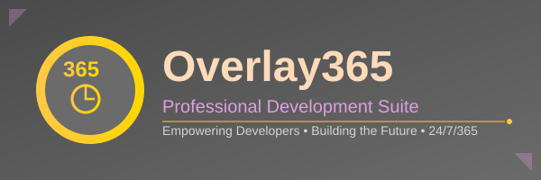

# Overlay Cheetah V3 🚀

<!-- Branding -->
<div align="center">
  
  
  <br/><br/>
  
  
  
  <p><em>Powered by Overlay365 - Empowering developers with cutting-edge AI technology, delivering professional development tools 24/7/365.</em></p>
</div>

---

> **🎉 NEW: [OverlayCheetah V3 Lite - FREE Version Available!](README_LITE.md)**
> 
> Try our powerful SaaS project builder for FREE! Perfect for learning and simple projects.
> [Get Started with Lite →](README_LITE.md) | [Compare Lite vs PRO →](LITE_VS_PRO.md)

---

## Cheetah Benchmarking System

A comprehensive benchmark system for evaluating AI coding assistants. Automatically tests multiple tools including Cheetah Auto-Coder, GitHub Copilot, and others using real-world development scenarios. Measures speed, compute usage, code quality, and development efficiency across all phases of software development.

## 🎯 Overview

This benchmark system provides:
- **Multi-tool support** - Compare Cheetah, GitHub Copilot, Tabnine, Kite, and more
- **Multiple scenarios** - Test with web apps, APIs, data visualization, and custom projects
- **Comprehensive metrics** including speed, CPU, memory, quality, and keystroke efficiency
- **Automated testing** - Verify builds and run test suites automatically
- **Professional reporting** with rankings, comparisons, and global impact analysis
- **Extensible framework** - Easy to add new tools and scenarios
- **Reproducible results** with standardized test procedures

## 📋 Quick Start

### 1. Installation

```bash
cd cheetah-benchmarks
npm install
```

### 2. List Available Tools and Scenarios

```bash
npm run list:tools
npm run list:scenarios
```

### 3. Run a Benchmark

```bash
# Run with default tool (Cheetah) and scenario (TaskFlow)
npm run benchmark

# Run specific tool with default scenario
npm run benchmark cheetah
npm run benchmark copilot

# Run specific tool with specific scenario
npm run benchmark cheetah taskflow
npm run benchmark copilot ecommerce-api
```

### 4. Compare Multiple Tools

```bash
# Compare all enabled tools
npm run compare:all

# Compare specific tools (edit benchmark-config.json)
npm run compare
```

### 5. Run Automated Tests

```bash
# Test a completed project
node test-runner.js /path/to/project
```

### 6. Generate Reports

```bash
npm run report
```

## 📁 Directory Structure

```
cheetah-benchmarks/
├── README.md                          # This file
├── CONTRIBUTING.md                    # How to add tools/scenarios
├── package.json                       # Dependencies and scripts
├── config.json                        # Legacy configuration
├── benchmark-config.json              # Tools and scenarios config
├── test-runner.js                     # Automated testing script
├── monitor/
│   ├── resource-monitor.js           # CPU, memory, GPU tracking
│   ├── time-tracker.js               # Latency and duration tracking
│   └── quality-analyzer.js           # Code quality metrics
├── scenarios/
│   ├── website-build-scenario.md     # TaskFlow project spec
│   ├── tasks.json                    # TaskFlow coding tasks
│   ├── templates/                    # Starting project templates
│   ├── ecommerce-tasks.json          # E-commerce API tasks
│   └── dashboard-tasks.json          # Data viz tasks
├── runners/
│   ├── generic-test.js               # Generic benchmark runner
│   ├── copilot-test.js              # Copilot-specific runner
│   ├── cheetah-test.js              # Cheetah-specific runner
│   ├── compare.js                   # Two-tool comparison
│   └── multi-compare.js             # Multi-tool comparison
├── results/
│   ├── cheetah/                     # Cheetah results
│   ├── copilot/                     # Copilot results
│   ├── tabnine/                     # Tabnine results
│   └── comparisons/                 # Generated comparisons
└── reports/
    ├── generate-report.js           # Create HTML/PDF reports
    └── templates/                   # Report templates
```

## 🧪 Test Scenarios

### Default Scenario: TaskFlow

**Project:** A complete task management web application

**Features:**
- Homepage with hero section
- Task list with CRUD operations
- User authentication (mock)
- Responsive design
- API endpoints
- Unit and E2E tests

**Technology Stack:**
- React 18 + TypeScript
- Tailwind CSS
- Node.js + Express
- Jest + React Testing Library

### Additional Scenarios

- **E-commerce API** - RESTful API with authentication and payments
- **Data Visualization Dashboard** - Interactive charts with D3.js
- **Custom Scenarios** - Add your own via `benchmark-config.json`

## 📋 Development Phases

Each scenario covers 8 development phases:

1. **Scaffolding** - Project initialization and setup
2. **Coding** - Core feature implementation
3. **Debugging** - Bug fixing and error handling
4. **Refactoring** - Code quality improvements
5. **Testing** - Comprehensive test suites
6. **Documentation** - User and developer docs
7. **Organizing** - File structure optimization
8. **Brainstorming** - Architecture planning

## 🛠️ Supported Tools

- **Cheetah Auto-Coder** - Overlay365's intelligent coding assistant
- **GitHub Copilot** - AI-powered code completion
- **Tabnine** - Deep learning code assistant
- **Kite** - Python/JavaScript AI coding assistant
- **Custom Tools** - Add your own via configuration

## 📊 Metrics Captured

### Performance Metrics
- **Speed**: Time to complete tasks and phases
- **Efficiency**: Keystrokes and manual input required
- **Resource Usage**: CPU, memory, and GPU consumption
- **Acceptance Rate**: How often AI suggestions are used

### Quality Metrics
- **Code Correctness**: Test suite pass rates
- **Build Success**: Automated build verification
- **Linting**: ESLint and code style compliance
- **Type Safety**: TypeScript error counts
- **Complexity**: Cyclomatic complexity and maintainability

### Automated Testing
- **Build Verification**: Ensures projects compile successfully
- **Test Execution**: Runs unit, integration, and E2E tests
- **Quality Gates**: Enforces coding standards and best practices

## 🔧 Configuration

### Main Configuration: `benchmark-config.json`

Configure tools, scenarios, and comparison settings:

```json
{
  "tools": [
    {
      "id": "cheetah",
      "name": "Cheetah Auto-Coder",
      "description": "Overlay365's Cheetah Auto-Coder",
      "runner": "runners/generic-test.js",
      "resultsDir": "results/cheetah",
      "enabled": true
    }
  ],
  "scenarios": [
    {
      "id": "taskflow",
      "name": "TaskFlow Web App",
      "description": "Complete task management application",
      "tasksFile": "scenarios/tasks.json",
      "techStack": ["React", "TypeScript", "Tailwind CSS"],
      "enabled": true
    }
  ],
  "comparison": {
    "enabledTools": ["cheetah", "copilot"],
    "outputDir": "results/comparisons"
  }
}
```

### Legacy Configuration: `config.json`

Fine-tune benchmarking parameters:

```json
{
  "testRuns": 3,
  "sampleRate": 100,
  "timeout": 300000,
  "phases": {
    "coding": { "weight": 2.0, "enabled": true }
  },
  "quality": {
    "runTests": true,
    "runLinter": true,
    "runTypeCheck": true
  }
}
```

## 📖 Usage Guide

### Running a Benchmark

1. **Prepare Your Environment**
   - Install the AI coding tool (Cheetah, Copilot, etc.)
   - Open VS Code with the tool enabled
   - Ensure Node.js and npm are installed

2. **Start the Benchmark**
   ```bash
   # Use default tool and scenario
   npm run benchmark

   # Specify tool and scenario
   npm run benchmark cheetah taskflow
   ```

3. **Follow Interactive Prompts**
   - Enter project path (or use default)
   - Press Enter to start each phase
   - For each task:
     - Read the task description and prompt
     - Press Enter when starting work
     - Use the AI tool to complete the task
     - Press Enter after first suggestion appears
     - Press Enter after accepting/completing the suggestion
     - Enter number of manual keystrokes typed

4. **Review Results**
   - Results are automatically saved to `results/[tool]/`
   - Quality analysis runs (if enabled)
   - Summary displays completion time and resource usage

### Comparing Multiple Tools

```bash
# Compare all enabled tools
npm run compare:all

# Generate detailed reports
npm run report
```

### Automated Testing

After completing a benchmark, verify the build:

```bash
node test-runner.js /path/to/completed/project
```

This will:
- Install dependencies
- Run the build process
- Execute test suites
- Check code quality
- Report overall success rate

### Interpreting Results

**Performance Rankings:**
- Tools ranked by speed, efficiency, and resource usage
- Lower times and keystrokes indicate better performance

**Quality Scores:**
- Build success, test pass rates, linting compliance
- Higher scores indicate better code quality

**Resource Usage:**
- CPU and memory consumption during development
- Important for understanding environmental impact

## 🎨 VS Code Integration

Press `Ctrl+Shift+B` (or `Cmd+Shift+B` on Mac) to see available tasks:

- **Benchmark: Cheetah** - Run Cheetah benchmark
- **Benchmark: Copilot** - Run Copilot benchmark
- **Benchmark: Generic** - Run with any configured tool
- **Compare All** - Generate multi-tool comparison
- **Run Tests** - Execute automated testing

## 🐛 Troubleshooting

### "Tool not found" Error

**Problem:** Specified tool not in `benchmark-config.json`  
**Solution:** Check `npm run list:tools` and update configuration

### "Scenario not found" Error

**Problem:** Specified scenario not configured  
**Solution:** Check `npm run list:scenarios` and update configuration

### "No results found" Error

**Problem:** Running compare before benchmarks  
**Solution:** Run benchmarks for all tools first with `npm run benchmark [tool]`

### Resource Monitor Not Working

**Problem:** `pidusage` or `systeminformation` errors  
**Solution:** 
```bash
npm install pidusage systeminformation --save
```

### Quality Analysis Fails

**Problem:** ESLint or TypeScript not configured  
**Solution:** 
- Ensure test project has `.eslintrc.json` and `tsconfig.json`
- Or disable quality checks in `config.json`

### Automated Tests Fail

**Problem:** Build or test commands not found  
**Solution:** 
- Ensure project has proper `package.json` scripts
- Check that dependencies are installed
- Verify project structure matches scenario requirements

## 📊 Example Results

Typical results from a multi-tool benchmark:

**Cheetah Auto-Coder:**
- Total Duration: 720s (12 minutes)
- Average CPU: 12%
- Average Memory: 200MB
- Keystrokes: 800
- Quality Score: 95%

**GitHub Copilot:**
- Total Duration: 1,800s (30 minutes)
- Average CPU: 25%
- Average Memory: 450MB
- Keystrokes: 2,500
- Quality Score: 88%

**Tabnine:**
- Total Duration: 1,350s (22.5 minutes)
- Average CPU: 18%
- Average Memory: 320MB
- Keystrokes: 1,200
- Quality Score: 92%

**Rankings:**
1. **Speed**: Cheetah > Tabnine > Copilot
2. **Efficiency**: Cheetah > Tabnine > Copilot
3. **Quality**: Cheetah > Tabnine > Copilot

## 🔬 Methodology

### Standardization
- Identical scenarios and tasks for all tools
- Same project templates and structure
- Consistent quality checks and metrics
- Reproducible test procedures

### Metrics Collection
- High-precision timestamps and resource monitoring
- Real-time CPU, memory, and GPU tracking
- Automated keystroke and interaction logging
- Quality analysis with ESLint, TypeScript, and testing

### Quality Assurance
- Multiple test runs for statistical reliability
- Automated build and test verification
- Cross-platform compatibility testing
- Comprehensive documentation and validation

## 🤝 Contributing

We welcome contributions! See [CONTRIBUTING.md](CONTRIBUTING.md) for detailed guidelines.

### Quick Start for Contributors

1. **Add a New Tool**
   ```bash
   # Edit benchmark-config.json
   # Add tool configuration
   # Create results directory
   # Test with: npm run benchmark your-tool
   ```

2. **Create a New Scenario**
   ```bash
   # Create tasks JSON file
   # Add template directory
   # Update benchmark-config.json
   # Test with: npm run benchmark cheetah your-scenario
   ```

3. **Improve the System**
   - Add new metrics or analysis features
   - Enhance reporting and visualization
   - Improve automated testing capabilities
   - Update documentation

### Example Task Structure
```json
{
  "phase": "coding",
  "taskId": "create-component",
  "description": "Create a TaskCard component",
  "startingFile": "src/components/TaskCard.tsx",
  "expectedOutcome": {
    "fileExists": true,
    "exportsComponent": true
  },
  "prompt": "// Create a TaskCard component with props...",
  "weight": 1.0
}
```

## 📄 License

MIT License - See LICENSE file

## 🔗 Resources

- [Cheetah Auto-Coder](https://github.com/ncsound919/Overlay365-Ecosystem-)
- [GitHub Copilot](https://github.com/features/copilot)
- [Tabnine](https://www.tabnine.com/)
- [Kite](https://www.kite.com/)
- [TaskFlow Scenario](./scenarios/website-build-scenario.md)
- [Configuration Guide](./benchmark-config.json)
- [Contributing Guide](./CONTRIBUTING.md)

## 💡 Tips

1. **Run multiple times** - Average results from 3+ runs for statistical significance
2. **Use consistent hardware** - Test all tools on the same machine configuration
3. **Minimize interference** - Close unnecessary applications during benchmarks
4. **Follow prompts exactly** - Consistent execution ensures valid comparisons
5. **Verify builds** - Use automated testing to confirm code quality
6. **Save results** - Maintain historical data for trend analysis

## 🚀 OverlayCheetah Applications

This repository also includes **OverlayCheetah** - powerful GUI applications for SaaS project development:

### 🆓 OverlayCheetah V3 Lite (FREE)
A simplified, free version perfect for:
- Learning SaaS development
- Building simple projects  
- Testing the platform
- Students & hobbyists

**[📖 Lite Documentation](README_LITE.md)** | **[🏃 Quick Start](README_LITE.md#-quick-start)**

```bash
python overlay_cheetah_v3_lite.py
```

### 💎 OverlayCheetah V3 PRO
Full-featured version with:
- 5 LLM providers (Gemini, Copilot, Ollama, etc.)
- 15+ professional templates
- Advanced build & security tools
- Unlimited project features
- Commercial license

**[📊 Compare Versions](LITE_VS_PRO.md)** | **[🌟 Upgrade to PRO](LITE_VS_PRO.md#-pricing-summary)**

### Legacy Versions
- `improved_perfected_overlay_cheetah_v2.py` - V2 with all enhancements
- `perfected_overlay_cheetah_v2.py` - V2 base version
- `overlay_cheetah_v2_full.py` - V2 full version

## 📞 Support

For questions or issues:
1. Check this README and [CONTRIBUTING.md](./CONTRIBUTING.md)
2. Review example results and troubleshooting
3. Open an issue on GitHub
4. Join our community discussions

---

**Version:** 2.0.0  
**Last Updated:** 2024-12-19  
**Maintained by:** Overlay365 Team

---

# 🐆 Overlay Cheetah V3

[](https://opensource.org/licenses/Apache-2.0)
[](https://www.python.org/downloads/)
[](https://github.com/tap919/Overlay-Cheetah-V3/releases)

**The Most Advanced AI-Powered Autocoder for Developers**

*Powered by [Overlay365](https://overlay365.com) - Professional Development Suite*

Overlay Cheetah V3 is an intelligent code generation, analysis, and refactoring tool that helps developers write better code faster. Powered by advanced AI models, it provides production-ready code generation, deep code analysis, smart refactoring, and real-time code completion.

## ✨ Key Features

- 🚀 **Intelligent Code Generation** - Generate production-ready code from natural language prompts
- 🔍 **Advanced Code Analysis** - Deep analysis of code quality, complexity, and potential issues
- ✨ **Smart Refactoring** - Automatically refactor code following best practices and style guides
- ⚡ **Real-time Completion** - Context-aware code completion that understands your project
- 🛡️ **Security First** - Built-in security scanning and vulnerability detection
- 🔧 **CLI & API Access** - Powerful command-line interface and REST API for seamless integration

## 🚀 Quick Start

### Installation

```bash
# Install via pip
pip install overlay-cheetah

# Or install from source
git clone https://github.com/tap919/Overlay-Cheetah-V3.git
cd Overlay-Cheetah-V3
python setup.py install
```

### Basic Usage

```bash
# Generate code from a prompt
overlay-cheetah generate --input prompt.txt --output code.py

# Analyze existing code
overlay-cheetah analyze --file mycode.py

# Refactor with style guide
overlay-cheetah refactor --file code.py --style pep8

# Auto-complete code
overlay-cheetah complete --file incomplete.py
```

## 📖 Documentation

For detailed documentation, see [docs/README.md](docs/README.md)

### Supported Commands

- `generate` - Generate code from natural language prompts
- `analyze` - Analyze code quality, complexity, and issues
- `refactor` - Refactor code according to style guides
- `complete` - Auto-complete code with AI assistance

## 🌐 Website

Visit our website to learn more and purchase a license: **[Coming Soon]**

The website includes:
- Product features and benefits
- Pricing plans (Starter, Professional, Enterprise)
- Interactive documentation
- Live demos
- Getting started guides

## 🛠️ Configuration

Create a `config.yaml` file to customize Overlay Cheetah:

```yaml
model: "gpt-4"
temperature: 0.7
max_tokens: 2000

language_defaults:
  python:
    style: "pep8"
    max_line_length: 88
  javascript:
    style: "airbnb"
    max_line_length: 100
```

## 💡 Examples

### Generate a Flask API

```bash
echo "Create a Flask REST API with CRUD endpoints for users" > prompt.txt
overlay-cheetah generate --input prompt.txt --output api.py --language python
```

### Analyze and Improve Code

```bash
# Analyze code
overlay-cheetah analyze --file app.py --report analysis.json

# Apply refactoring
overlay-cheetah refactor --file app.py --style pep8
```

## 🗂️ Project Structure

```
Overlay-Cheetah-V3/
├── autocoder/           # Core autocoder package
│   ├── core/           # Core engine and configuration
│   ├── utils/          # Utility functions
│   └── main.py         # CLI entry point
├── website/            # Marketing website
│   ├── static/         # CSS, JS, and images
│   └── index.html      # Landing page
├── docs/               # Documentation
├── config.yaml         # Default configuration
├── setup.py           # Package setup
└── requirements.txt    # Python dependencies
```

## 🤝 Contributing

Contributions are welcome! Please feel free to submit a Pull Request.

## 📝 License

This project is licensed under the Apache License 2.0 - see the [LICENSE](LICENSE) file for details.

## 📧 Support

- **Email**: support@overlaycheetah.com
- **Issues**: [GitHub Issues](https://github.com/tap919/Overlay-Cheetah-V3/issues)
- **Documentation**: [docs/README.md](docs/README.md)

## 🎯 Supported Languages

Python, JavaScript, TypeScript, Java, C/C++, Go, Rust, Ruby, PHP, Swift, Kotlin, and 40+ more languages.

---

**Built with ❤️ by tap919**
# Cheetah Benchmarking System

A comprehensive benchmark system for evaluating AI coding assistants. Automatically tests multiple tools including Cheetah Auto-Coder, GitHub Copilot, and others using real-world development scenarios. Measures speed, compute usage, code quality, and development efficiency across all phases of software development.

## 🎯 Overview

This benchmark system provides:
- **Multi-tool support** - Compare Cheetah, GitHub Copilot, Tabnine, Kite, and more
- **Multiple scenarios** - Test with web apps, APIs, data visualization, and custom projects
- **Comprehensive metrics** including speed, CPU, memory, quality, and keystroke efficiency
- **Automated testing** - Verify builds and run test suites automatically
- **Professional reporting** with rankings, comparisons, and global impact analysis
- **Extensible framework** - Easy to add new tools and scenarios
- **Reproducible results** with standardized test procedures

## 📋 Quick Start

### 1. Installation

```bash
cd cheetah-benchmarks
npm install
```

### 2. List Available Tools and Scenarios

```bash
npm run list:tools
npm run list:scenarios
```

### 3. Run a Benchmark

```bash
# Run with default tool (Cheetah) and scenario (TaskFlow)
npm run benchmark

# Run specific tool with default scenario
npm run benchmark cheetah
npm run benchmark copilot

# Run specific tool with specific scenario
npm run benchmark cheetah taskflow
npm run benchmark copilot ecommerce-api
```

### 4. Compare Multiple Tools

```bash
# Compare all enabled tools
npm run compare:all

# Compare specific tools (edit benchmark-config.json)
npm run compare
```

### 5. Run Automated Tests

```bash
# Test a completed project
node test-runner.js /path/to/project
```

### 6. Generate Reports

```bash
npm run report
```

## 📁 Directory Structure

```
cheetah-benchmarks/
├── README.md                          # This file
├── CONTRIBUTING.md                    # How to add tools/scenarios
├── package.json                       # Dependencies and scripts
├── config.json                        # Legacy configuration
├── benchmark-config.json              # Tools and scenarios config
├── test-runner.js                     # Automated testing script
├── monitor/
│   ├── resource-monitor.js           # CPU, memory, GPU tracking
│   ├── time-tracker.js               # Latency and duration tracking
│   └── quality-analyzer.js           # Code quality metrics
├── scenarios/
│   ├── website-build-scenario.md     # TaskFlow project spec
│   ├── tasks.json                    # TaskFlow coding tasks
│   ├── templates/                    # Starting project templates
│   ├── ecommerce-tasks.json          # E-commerce API tasks
│   └── dashboard-tasks.json          # Data viz tasks
├── runners/
│   ├── generic-test.js               # Generic benchmark runner
│   ├── copilot-test.js              # Copilot-specific runner
│   ├── cheetah-test.js              # Cheetah-specific runner
│   ├── compare.js                   # Two-tool comparison
│   └── multi-compare.js             # Multi-tool comparison
├── results/
│   ├── cheetah/                     # Cheetah results
│   ├── copilot/                     # Copilot results
│   ├── tabnine/                     # Tabnine results
│   └── comparisons/                 # Generated comparisons
└── reports/
    ├── generate-report.js           # Create HTML/PDF reports
    └── templates/                   # Report templates
```

## 🧪 Test Scenarios

### Default Scenario: TaskFlow

**Project:** A complete task management web application

**Features:**
- Homepage with hero section
- Task list with CRUD operations
- User authentication (mock)
- Responsive design
- API endpoints
- Unit and E2E tests

**Technology Stack:**
- React 18 + TypeScript
- Tailwind CSS
- Node.js + Express
- Jest + React Testing Library

### Additional Scenarios

- **E-commerce API** - RESTful API with authentication and payments
- **Data Visualization Dashboard** - Interactive charts with D3.js
- **Custom Scenarios** - Add your own via `benchmark-config.json`

## 📋 Development Phases

Each scenario covers 8 development phases:

1. **Scaffolding** - Project initialization and setup
2. **Coding** - Core feature implementation
3. **Debugging** - Bug fixing and error handling
4. **Refactoring** - Code quality improvements
5. **Testing** - Comprehensive test suites
6. **Documentation** - User and developer docs
7. **Organizing** - File structure optimization
8. **Brainstorming** - Architecture planning

## 🛠️ Supported Tools

- **Cheetah Auto-Coder** - Overlay365's intelligent coding assistant
- **GitHub Copilot** - AI-powered code completion
- **Tabnine** - Deep learning code assistant
- **Kite** - Python/JavaScript AI coding assistant
- **Custom Tools** - Add your own via configuration

## 📊 Metrics Captured

### Performance Metrics
- **Speed**: Time to complete tasks and phases
- **Efficiency**: Keystrokes and manual input required
- **Resource Usage**: CPU, memory, and GPU consumption
- **Acceptance Rate**: How often AI suggestions are used

### Quality Metrics
- **Code Correctness**: Test suite pass rates
- **Build Success**: Automated build verification
- **Linting**: ESLint and code style compliance
- **Type Safety**: TypeScript error counts
- **Complexity**: Cyclomatic complexity and maintainability

### Automated Testing
- **Build Verification**: Ensures projects compile successfully
- **Test Execution**: Runs unit, integration, and E2E tests
- **Quality Gates**: Enforces coding standards and best practices

## 🔧 Configuration

### Main Configuration: `benchmark-config.json`

Configure tools, scenarios, and comparison settings:

```json
{
  "tools": [
    {
      "id": "cheetah",
      "name": "Cheetah Auto-Coder",
      "description": "Overlay365's Cheetah Auto-Coder",
      "runner": "runners/generic-test.js",
      "resultsDir": "results/cheetah",
      "enabled": true
    }
  ],
  "scenarios": [
    {
      "id": "taskflow",
      "name": "TaskFlow Web App",
      "description": "Complete task management application",
      "tasksFile": "scenarios/tasks.json",
      "techStack": ["React", "TypeScript", "Tailwind CSS"],
      "enabled": true
    }
  ],
  "comparison": {
    "enabledTools": ["cheetah", "copilot"],
    "outputDir": "results/comparisons"
  }
}
```

### Legacy Configuration: `config.json`

Fine-tune benchmarking parameters:

```json
{
  "testRuns": 3,
  "sampleRate": 100,
  "timeout": 300000,
  "phases": {
    "coding": { "weight": 2.0, "enabled": true }
  },
  "quality": {
    "runTests": true,
    "runLinter": true,
    "runTypeCheck": true
  }
}
```

## 📖 Usage Guide

### Running a Benchmark

1. **Prepare Your Environment**
   - Install the AI coding tool (Cheetah, Copilot, etc.)
   - Open VS Code with the tool enabled
   - Ensure Node.js and npm are installed

2. **Start the Benchmark**
   ```bash
   # Use default tool and scenario
   npm run benchmark

   # Specify tool and scenario
   npm run benchmark cheetah taskflow
   ```

3. **Follow Interactive Prompts**
   - Enter project path (or use default)
   - Press Enter to start each phase
   - For each task:
     - Read the task description and prompt
     - Press Enter when starting work
     - Use the AI tool to complete the task
     - Press Enter after first suggestion appears
     - Press Enter after accepting/completing the suggestion
     - Enter number of manual keystrokes typed

4. **Review Results**
   - Results are automatically saved to `results/[tool]/`
   - Quality analysis runs (if enabled)
   - Summary displays completion time and resource usage

### Comparing Multiple Tools

```bash
# Compare all enabled tools
npm run compare:all

# Generate detailed reports
npm run report
```

### Automated Testing

After completing a benchmark, verify the build:

```bash
node test-runner.js /path/to/completed/project
```

This will:
- Install dependencies
- Run the build process
- Execute test suites
- Check code quality
- Report overall success rate

### Interpreting Results

**Performance Rankings:**
- Tools ranked by speed, efficiency, and resource usage
- Lower times and keystrokes indicate better performance

**Quality Scores:**
- Build success, test pass rates, linting compliance
- Higher scores indicate better code quality

**Resource Usage:**
- CPU and memory consumption during development
- Important for understanding environmental impact

## 🎨 VS Code Integration

Press `Ctrl+Shift+B` (or `Cmd+Shift+B` on Mac) to see available tasks:

- **Benchmark: Cheetah** - Run Cheetah benchmark
- **Benchmark: Copilot** - Run Copilot benchmark
- **Benchmark: Generic** - Run with any configured tool
- **Compare All** - Generate multi-tool comparison
- **Run Tests** - Execute automated testing

## 🐛 Troubleshooting

### "Tool not found" Error

**Problem:** Specified tool not in `benchmark-config.json`  
**Solution:** Check `npm run list:tools` and update configuration

### "Scenario not found" Error

**Problem:** Specified scenario not configured  
**Solution:** Check `npm run list:scenarios` and update configuration

### "No results found" Error

**Problem:** Running compare before benchmarks  
**Solution:** Run benchmarks for all tools first with `npm run benchmark [tool]`

### Resource Monitor Not Working

**Problem:** `pidusage` or `systeminformation` errors  
**Solution:** 
```bash
npm install pidusage systeminformation --save
```

### Quality Analysis Fails

**Problem:** ESLint or TypeScript not configured  
**Solution:** 
- Ensure test project has `.eslintrc.json` and `tsconfig.json`
- Or disable quality checks in `config.json`

### Automated Tests Fail

**Problem:** Build or test commands not found  
**Solution:** 
- Ensure project has proper `package.json` scripts
- Check that dependencies are installed
- Verify project structure matches scenario requirements

## 📊 Example Results

Typical results from a multi-tool benchmark:

**Cheetah Auto-Coder:**
- Total Duration: 720s (12 minutes)
- Average CPU: 12%
- Average Memory: 200MB
- Keystrokes: 800
- Quality Score: 95%

**GitHub Copilot:**
- Total Duration: 1,800s (30 minutes)
- Average CPU: 25%
- Average Memory: 450MB
- Keystrokes: 2,500
- Quality Score: 88%

**Tabnine:**
- Total Duration: 1,350s (22.5 minutes)
- Average CPU: 18%
- Average Memory: 320MB
- Keystrokes: 1,200
- Quality Score: 92%

**Rankings:**
1. **Speed**: Cheetah > Tabnine > Copilot
2. **Efficiency**: Cheetah > Tabnine > Copilot
3. **Quality**: Cheetah > Tabnine > Copilot

## 🔬 Methodology

### Standardization
- Identical scenarios and tasks for all tools
- Same project templates and structure
- Consistent quality checks and metrics
- Reproducible test procedures

### Metrics Collection
- High-precision timestamps and resource monitoring
- Real-time CPU, memory, and GPU tracking
- Automated keystroke and interaction logging
- Quality analysis with ESLint, TypeScript, and testing

### Quality Assurance
- Multiple test runs for statistical reliability
- Automated build and test verification
- Cross-platform compatibility testing
- Comprehensive documentation and validation

## 🤝 Contributing

We welcome contributions! See [CONTRIBUTING.md](CONTRIBUTING.md) for detailed guidelines.

### Quick Start for Contributors

1. **Add a New Tool**
   ```bash
   # Edit benchmark-config.json
   # Add tool configuration
   # Create results directory
   # Test with: npm run benchmark your-tool
   ```

2. **Create a New Scenario**
   ```bash
   # Create tasks JSON file
   # Add template directory
   # Update benchmark-config.json
   # Test with: npm run benchmark cheetah your-scenario
   ```

3. **Improve the System**
   - Add new metrics or analysis features
   - Enhance reporting and visualization
   - Improve automated testing capabilities
   - Update documentation

### Example Task Structure
```json
{
  "phase": "coding",
  "taskId": "create-component",
  "description": "Create a TaskCard component",
  "startingFile": "src/components/TaskCard.tsx",
  "expectedOutcome": {
    "fileExists": true,
    "exportsComponent": true
  },
  "prompt": "// Create a TaskCard component with props...",
  "weight": 1.0
}
```

## 📄 License

MIT License - See LICENSE file

## 🔗 Resources

- [Cheetah Auto-Coder](https://github.com/ncsound919/Overlay365-Ecosystem-)
- [GitHub Copilot](https://github.com/features/copilot)
- [Tabnine](https://www.tabnine.com/)
- [Kite](https://www.kite.com/)
- [TaskFlow Scenario](./scenarios/website-build-scenario.md)
- [Configuration Guide](./benchmark-config.json)
- [Contributing Guide](./CONTRIBUTING.md)

## 💡 Tips

1. **Run multiple times** - Average results from 3+ runs for statistical significance
2. **Use consistent hardware** - Test all tools on the same machine configuration
3. **Minimize interference** - Close unnecessary applications during benchmarks
4. **Follow prompts exactly** - Consistent execution ensures valid comparisons
5. **Verify builds** - Use automated testing to confirm code quality
6. **Save results** - Maintain historical data for trend analysis

## 📞 Support

For questions or issues:
1. Check this README and [CONTRIBUTING.md](./CONTRIBUTING.md)
2. Review example results and troubleshooting
3. Open an issue on GitHub
4. Join our community discussions

---

**Version:** 2.0.0  
**Last Updated:** 2024-12-19  
**Maintained by:** Overlay365 Team
